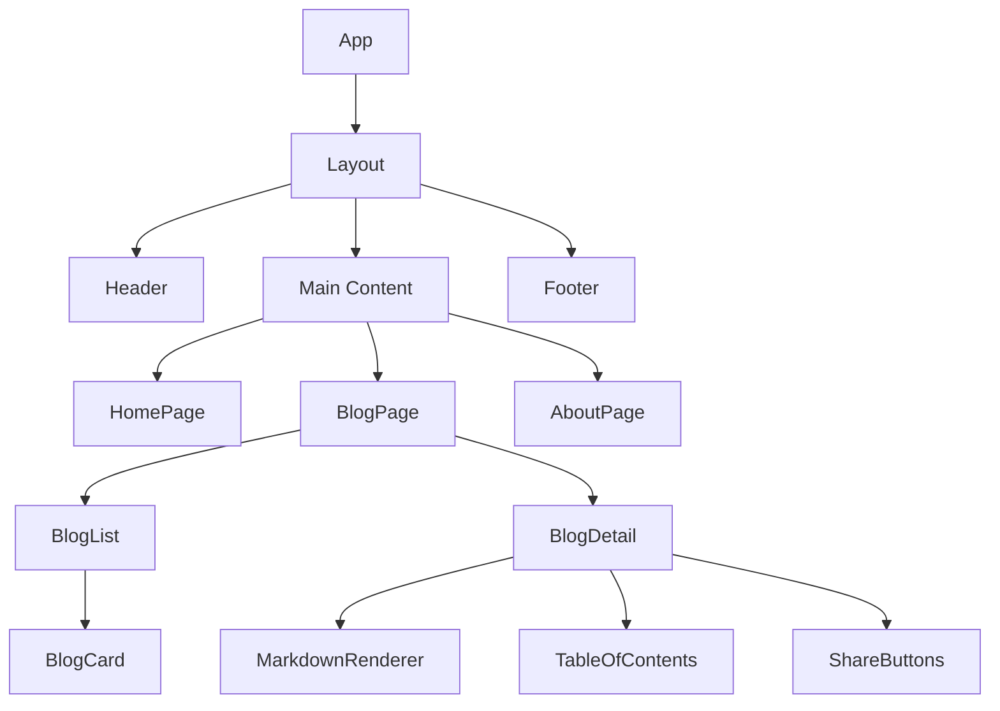

React remains the most popular UI library in the JavaScript ecosystem. Whether you're building a portfolio site, a SaaS dashboard, or a full-scale enterprise application, React gives you the tools to create fast, interactive, and maintainable user interfaces.

In this guide, we'll walk through everything you need to know to start building with React — from the fundamentals to production-ready patterns.

---

## Prerequisites

Before diving into React, make sure you're comfortable with:

- **HTML & CSS** — Semantic markup, Flexbox, Grid, responsive design
- **JavaScript (ES6+)** — Arrow functions, destructuring, modules, promises, async/await
- **Git & GitHub** — Basic version control workflow
- **Command Line** — Navigating directories, running scripts

> [!TIP]
> If you're not confident with modern JavaScript, spend a week on [javascript.info](https://javascript.info) before starting React. It will make everything click faster.

---

## What is React?

React is a **declarative, component-based** JavaScript library for building user interfaces. Created by Facebook (now Meta) in 2013, it introduced a paradigm shift in how we think about UI development.

### Key Concepts

| Concept | Description |
|---------|-------------|
| **Components** | Reusable, self-contained pieces of UI |
| **JSX** | HTML-like syntax that compiles to JavaScript |
| **Virtual DOM** | Efficient diffing algorithm for minimal DOM updates |
| **Hooks** | Functions that let you use state and lifecycle in functional components |
| **Props** | Data passed from parent to child components |

### Why React?

1. **Massive ecosystem** — Thousands of battle-tested libraries
2. **Strong community** — Active development, excellent documentation
3. **Job market** — Most in-demand frontend skill
4. **Flexibility** — Works for web, mobile (React Native), and desktop

---

## Setting Up Your First React Project

The fastest way to start a new React project in 2026 is with **Vite** or **Next.js**.

### Option 1: Vite (Client-Side)

```bash
npx create-vite@latest my-react-app -- --template react
cd my-react-app
npm install
npm run dev
```

### Option 2: Next.js (Full-Stack)

```bash
npx create-next-app@latest my-next-app
cd my-next-app
npm run dev
```

> [!NOTE]
> We recommend Next.js for production applications because it provides server-side rendering, static generation, API routes, and built-in optimizations out of the box.

---

## Understanding Components

Components are the building blocks of any React application. Think of them as custom HTML elements that encapsulate their own logic and appearance.

### Functional Components

```jsx
function Welcome({ name }) {
  return (
    <div className="welcome-card">
      <h2>Hello, {name}!</h2>
      <p>Welcome to React.</p>
    </div>
  );
}

// Usage
<Welcome name="Amrendra" />
```

### Component Composition

```jsx
function App() {
  return (
    <Layout>
      <Header />
      <main>
        <HeroSection />
        <FeaturedPosts />
        <Newsletter />
      </main>
      <Footer />
    </Layout>
  );
}
```

> [!IMPORTANT]
> Always start component names with a **capital letter**. React treats lowercase tags as HTML elements and uppercase as components.

---

## React Hooks Deep Dive

Hooks are the modern way to manage state and side effects in React.

### useState — Managing State

```jsx
import { useState } from 'react';

function Counter() {
  const [count, setCount] = useState(0);

  return (
    <div>
      <p>Count: {count}</p>
      <button onClick={() => setCount(count + 1)}>
        Increment
      </button>
    </div>
  );
}
```

### useEffect — Side Effects

```jsx
import { useState, useEffect } from 'react';

function UserProfile({ userId }) {
  const [user, setUser] = useState(null);
  const [loading, setLoading] = useState(true);

  useEffect(() => {
    async function fetchUser() {
      setLoading(true);
      const res = await fetch(`/api/users/${userId}`);
      const data = await res.json();
      setUser(data);
      setLoading(false);
    }

    fetchUser();
  }, [userId]); // Re-run when userId changes

  if (loading) return <Spinner />;
  return <ProfileCard user={user} />;
}
```

### Custom Hooks

Extract reusable logic into custom hooks:

```jsx
function useLocalStorage(key, initialValue) {
  const [value, setValue] = useState(() => {
    const stored = localStorage.getItem(key);
    return stored ? JSON.parse(stored) : initialValue;
  });

  useEffect(() => {
    localStorage.setItem(key, JSON.stringify(value));
  }, [key, value]);

  return [value, setValue];
}

// Usage
const [theme, setTheme] = useLocalStorage('theme', 'dark');
```

---

## State Management Patterns

### When to Use What

- **`useState`** — Local component state
- **`useReducer`** — Complex state logic with multiple sub-values
- **`useContext`** — Sharing state across the component tree
- **Zustand / Jotai** — Lightweight global state
- **TanStack Query** — Server state (API data, caching)

> [!WARNING]
> Avoid putting everything in global state. Most state should remain local to the component that needs it. Lift state up only when sibling components need to share data.

---

## Component Architecture Diagram

Here's how a typical React application is structured:



---

## Styling in React

### Popular Approaches

| Approach | Pros | Cons |
|----------|------|------|
| **Tailwind CSS** | Utility-first, fast prototyping | Verbose markup |
| **CSS Modules** | Scoped by default, familiar syntax | File overhead |
| **Styled Components** | Dynamic styling, co-located | Runtime cost |
| **Vanilla CSS** | No dependencies, maximum control | Global scope issues |

### Tailwind Example

```jsx
function Card({ title, description }) {
  return (
    <div className="bg-white rounded-xl shadow-lg p-6 hover:shadow-xl transition-shadow">
      <h3 className="text-xl font-bold text-gray-900 mb-2">{title}</h3>
      <p className="text-gray-600 leading-relaxed">{description}</p>
    </div>
  );
}
```

---

## Performance Best Practices

### Memoization

```jsx
import { memo, useMemo, useCallback } from 'react';

// Memoize component to prevent unnecessary re-renders
const ExpensiveList = memo(function ExpensiveList({ items, onSelect }) {
  return (
    <ul>
      {items.map(item => (
        <li key={item.id} onClick={() => onSelect(item.id)}>
          {item.name}
        </li>
      ))}
    </ul>
  );
});

// Memoize values and callbacks
function Parent() {
  const [filter, setFilter] = useState('');

  const filteredItems = useMemo(
    () => items.filter(item => item.name.includes(filter)),
    [items, filter]
  );

  const handleSelect = useCallback((id) => {
    console.log('Selected:', id);
  }, []);

  return <ExpensiveList items={filteredItems} onSelect={handleSelect} />;
}
```

### Performance Checklist

- [x] Use `React.memo` for expensive pure components
- [x] Memoize callbacks with `useCallback`
- [x] Memoize computed values with `useMemo`
- [ ] Implement code splitting with `React.lazy`
- [ ] Use `Suspense` for loading states
- [x] Avoid inline object/array creation in JSX

> [!CAUTION]
> Don't memoize everything blindly. Premature optimization adds complexity. Profile first with React DevTools, then optimize the bottlenecks.

---

## Math in React (Bonus)

If you're building educational or scientific applications, React can render math equations using KaTeX:

**Inline math**: The quadratic formula is $x = \frac{-b \pm \sqrt{b^2 - 4ac}}{2a}$.

**Block math**:

$$
E = mc^2
$$

$$
\sum_{i=1}^{n} i = \frac{n(n+1)}{2}
$$

---

## Project Structure

Here's a recommended folder structure for a production React project:

```
src/
├── app/              # Next.js routes
├── components/       # Reusable UI components
│   ├── ui/           # Primitive components (Button, Input)
│   ├── blog/         # Feature-specific components
│   └── layout/       # Layout components (Header, Footer)
├── hooks/            # Custom React hooks
├── lib/              # Utility functions
├── config/           # App configuration
├── styles/           # Global styles
└── types/            # TypeScript types (if using TS)
```

---

## Next Steps

After mastering the basics, explore these topics:

1. **Server Components** — React's newest paradigm for server-rendered UI
2. **Suspense & Streaming** — Progressive page loading
3. **React Server Actions** — Form handling without API routes
4. **Testing** — React Testing Library + Vitest
5. **Accessibility** — ARIA patterns, keyboard navigation
6. **Animation** — Framer Motion for production-grade animations

---

## Key Takeaways

React in 2026 is more powerful and developer-friendly than ever. Here's what matters:

- **Start simple** — Master `useState`, `useEffect`, and component composition first
- **Build projects** — Theory only goes so far; build real things
- **Use the ecosystem** — Don't reinvent the wheel; leverage proven libraries
- **Focus on patterns** — Component composition, custom hooks, and state management patterns are more important than memorizing APIs
- **Stay curious** — The React ecosystem evolves fast; follow the React blog and community leaders

Happy coding! 🚀
